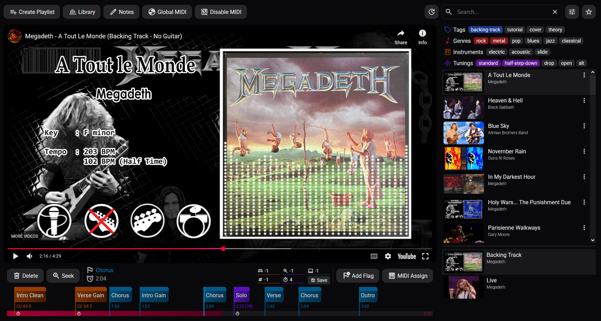

# Play-With-Me

Organize your backing tracks with midi automation



## Env

Create a .env file for your pocketbase secrets

```env
SECRET_EMAIL=
SECRET_PASSWORD=
```

## Run

Created using svelte-kit and pocketbase

```bash
npm install
npm run dev

./pocketbase serve
```
